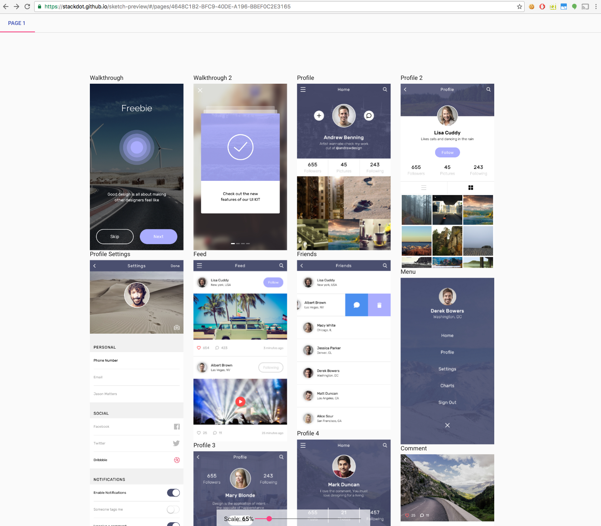
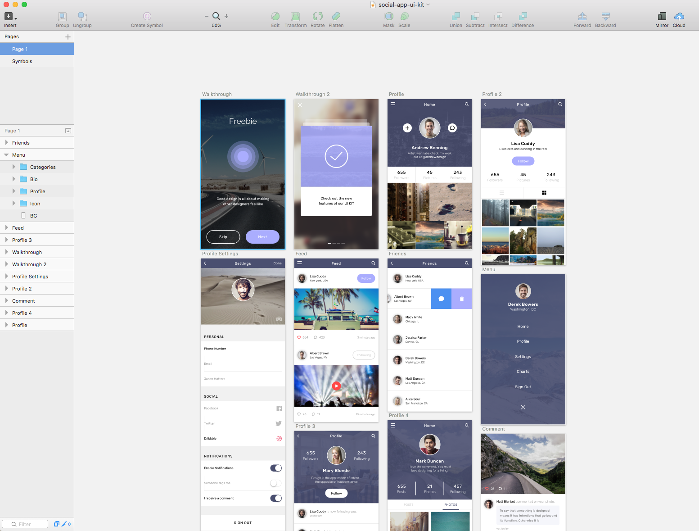

[](https://www.npmjs.com/package/sketch-preview) [](https://www.npmjs.com/package/sketch-preview) [](https://www.npmjs.com/package/sketch-preview) 

[](https://drone.stackdot.com/stackdot/sketch-preview) [](https://david-dm.org/stackdot/sketch-preview) [](https://codeclimate.com/github/stackdot/sketch-preview) [](https://www.npmjs.com/package/sketch-preview)


===

Sketch UI Generator

[Live GitHub Pages Demo](https://stackdot.github.io/sketch-preview/#/pages/4648C1B2-BFC9-40DE-A196-BBEF0C2E3165)

Generates a Interactable HTML website with your Sketch file.

## Generated in Browser:


## Actual Sketch App



Sketch file credits: [Sketch File](http://www.sketchappsources.com/free-source/1985-social-app-sketch-freebie-resource.html)


Requirements:
---

- Must be on Mac OSX ( You do *not* need Sketch App installed )
- [NodeJS](https://nodejs.org/en/download/) ( Version 6+ )
 - We recommend using [Node Version Manager](https://github.com/creationix/nvm)


To Get Started:
---

Install the package:
		
	npm install sketch-preview -g

Now you have a cli tool available, to use it:
	
	sketch-preview --input=mysketchfile.sketch --open

The `--open` at the end tells sketch-preview to open a browser tab to view your generated site. Otherwise it will simply build the static site in the `public` directory.


Including in your Gulp
---

You can also include this library in your gulp process, firstly make sure you install the package:

	npm install sketch-preview --save

Then inside of your gulpfile.js:

```javascript
// You must pass in your gulp variable for us to extend:
const preview = require('sketch-preview')({
	input: './sketch/TST.sketch',
}, gulp)

// Generate sketch preview files:
gulp.task('export', preview)
```


Running Dev:
---

Inside the directory run:

```bash
gulp
```

Be sure to run `npm update` to ensure all the NPM dependencies are up to date.


License
----

[MIT License](http://en.wikipedia.org/wiki/MIT_License)

